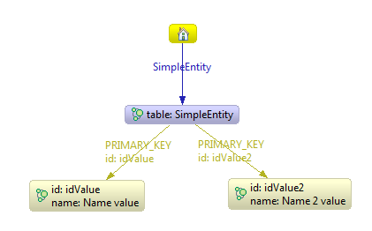

JPA entities to Neo4j mapping (Hibernate OGM)
================================
This page describes mapping strategies for JPA entities and their relationships. 
This is work in progress done in the context of the Hibernate OGM (http://www.hibernate.org/subprojects/ogm.html) project. It aims at illustrating decisions taken thus far as well as highlight issues to address.

Simple entities (without relationships)
-------------------------
Let's assume that we've got a simple entity illustrated in the code snippet below (constructors as well as getters / setters omitted):

```java
@Entity
public class SimpleEntity {

	@Id
	private String id;
	private String name;
}
```

